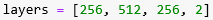

MakNN is a neural network library to create shallow or deep fully connected neural networks for regression, classification (both binary and multiclass classification) and multitask learning problems based on, but not limited to the deep learning specialization lectures by Andrew Ng. You can use this library for any research/academic purposes and for small scale commercial applications. I highly recommend comparing its performance (which I will provide soon) with existing state of the art deep learning frameworks while using it for commercial applications.

This library can be used to

1. Preprocess your dataset

    a. Normalize independent variables
    b. Split to train, dev and test sets    
    c. Encode the dependent variables

2. Create ANN&#39;s for

    a. Regression    
    b. Binary Classification    
    c. Multi class classification    
    d. Multi-task learning

3. Save, load and operate on saved models

4. Visualize parameters as well as model structures

5. Outputs from this model can be used to visualize/plot and evaluate your model performance

_Note: This library can&#39;t be used to build convolutional neural nets or sequential models (RNN, LSTM)_

**This library implements the following functions**

  1. Activations functions with their **derivatives**
    
        a. Sigmoid    
        b. SoftMax        
        c. Relu    
        d. Tanh        
        e. Leaky Relu
  2. Weight initialization
  3. Forward propagation
  4. Back propagation
  5. Optimization algorithms
    
        a. Momentum        
        b. RMS        
        c. Adam  
  6. Batch normalization
  7. Regularization
    
        a. L2        
        b. Dropouts  
  8. Frobenius norm
  9. Loss functions with their **derivatives**
        
        a. Mean square loss        
        b. Logarithmic loss  
  10. Prediction
  11. Prediction accuracy
  12. Exponential weighted average
  13. Learning decay
  14. Weight updates
  15. Model check points
  16. Early stopping
  17. Saving and reloading models
  18. Mini batch processing
  19. Other additional functions
    
        a. Normalize input        
        b. Split dataset        
        c. Encode dependent variables specially for multi-class classification

**How to use this library? (Use the classification problem example on a modified placement dataset taken from Kaggle)**

- Download and import this file into your script

- Create object of MakNN class

- Preprocessing components
    - Normalize your data (optional)

     

    - Split your data to train, dev and test

     

- Initialize your model:

        init_model(layer, activations, input_shape, l2_reg_param = 0, drop_out_param = [], batch_norm = [], weight_init = True)

    - layer: this is used to define hidden layers with the number of hidden units. It is defined as a list containing number of hidden units in each layer.

     

        This implies 4 hidden unites where the first and third layers contain 256 hidden units, the second hidden layer contains 512 hidden units and the output layer contains two hidden units.

    - activations: this is used to define activation functions at each layer and once again this is a list containing activations at each layer

     

        **Size of the activations list must be similar to the size of layers list. The above example shows that except the output layer with sigmoid activation, others have a relu activation.

   - input_shape: specifies the input dimension (number of independent variables) and the number of training examples in each batch.

     

            The above example specifies dimension of input with mini batches containing 10 training examples each. To use a simple gradient descent without mini batches set the second parameter of input shape to 1.

   - l2_reg_param: this is the lambda variable for L2 regularization (weight decay). Set it to a none zero value to apply L2 regularization.

            l2_reg_param = 0.67

   - drop_out_param: this is used to set dropout values at each hidden layer. Use a list containing dropout amount at each layer. **This list must have equal size with the number of layers.** Set dropout to zero if it is not required on that specific layer.

      

            The above example shows that 50% of hidden units in layer 1 and 3 will be dropped whereas 40% of the hidden units on layer two will be dropped, and no need on the final output layer where it is set to 0.

   - batch_norm: this is used to define batch normalization on any of the hidden units. **Similarly, this must have the same size as the layers list and the values are either true or false.**

 

    The above example shows normalization applied on the linear function Z of all hidden layers except the output layer

   - weight_init: a Boolean variable either to initialize the weights with a value true, use random values otherwise.

  

    With the model initialization, you will see the structure of your model with all the trainable parameters (only weights and biases) as follows

  

    You can also see the initialized weights and biases simply calling the variables as

  

**Note:** all except layers, activations and input\_shape variables are optional

- Train your model

        train_model(x_train, y_train, x_val, y_val, check_point = &#39;&#39;, early_stoping_steps = 0, optimizer =&#39;adam&#39;, loss=&#39;mean&#39;, learning_rate = 0.01, epoch = 1, beta_momentum = 0.9, beta_rms = 0.999, decay_rate = 0, batch_beta = 1, batch_gamma = 0, verbose = True)

    - x_train: this is an array containing values of dependent variables of training examples. The assumption here is all your dependent variables are numeric values.
    - y_train: this is an array containing class labels of the training examples. The assumption here is all your class labels are set to be numeric from 0 to N.
    - x_val: this is an array containing values of dependent variables of validation examples. The assumption here is all your dependent variables are numeric values.
    - y_val: this is an array containing class labels of the validation examples. The assumption here is all your class labels are set to be numeric from 0 to N.
    - check_point: this is a variable holding the parameter by which the model is identified as best, and save the best model throughout the training iterations. Possible values for the checkpoint parameter are,
      
            - train_acc      
            - train_loss      
            - val_acc      
            - val_loss
    - early_stopping: this is an integer value to define number of iterations to tolerate an increase in training loss before stopping model from learning. e.g. if _ **early_stopping = 2**, then model looks for 2 consecutive training loss increases and quite learning. Use early\_stoping with check\_points to save the best model before loss increases back again.
    - Optimizer: this is a parameter to set optimization algorithms while learning. Optionally, set beta\_momentum and beta\_rms hyperparameters to be used while optimizing. Possible optimizers to use are,
      
            - momentum      
            - rms      
            - adam
    - loss: this is a parameter to set the loss function to use at the end of forward passes. Possible loss functions are,
        
            - mean_square_loss      
            - logarithmic_loss
    - learning_rate: this is a numeric value to set the learning rate for weight updates.
    - epoch: this is used to define the number of iterations to train the model
    - beta_momentum: is a numeric value to be used while computing the momentum as well as adam optimizers.
    - rms_momentum: is a numeric value to be used while computing the rms as well as adam optimizers.
    - decay_rate: is a numeric value to penalize the learning rate at each epoch. Define this param if you want to lower the learning\_rate down the iteration.
    - batch_beta and batch_gama: these two parameters are used to penalize batch normalization. It is possible to make the model learn these parameters though not implemented in this library. Therefore, set them to proper values possibly after some experiments.
    - verbose: this is a Boolean value where, if set to true, training results will be displayed and not otherwise. Below, shows a result with verbose = True

**Note:**  **while training the model all except x_train, y_train, x_val and y_val are optional** 

For multiclass classification problem your dataset must have classes labeled from 0 to N and there is no need to encode the train and validation set. But for the prediction step, you need to call nm.encode_y() method to encode your test set class labels for better visualization and understanding of results.

-**Making Predictions**

   - to make predictions using the trained model call the function predict as

            mn.pridict(x), where x is one or more records of the independent variables

   Note: for multi class classification task to see the actual class labels, encode the dependent variable values first.

-**Working with saved models**
    - it is possible to save your model at the end of training by calling the function 
    
        mn.save_model('file_name.pkl')
        
   - to load and work with your model just use
   
         mn.load_model('file_name.pkl')

   Note: in both cases file_name is optional as it will save it or load it as 'saved_model.pkl' when the parameter is not set.

-**Further to do with the results**

   - Use matplotlib or other to plot the learning trend
   - Use sikitlearn or other to plot the confusion matric, compute precision recall and f1 scores

